# GuardianLens Architecture & Workflow

## 1. System Architecture
This high-level diagram shows how the different components of the Chrome Extension interact with the browser, storage, and external AI services.

```mermaid
graph TD
    subgraph "Chrome Browser"
        User[👤 User / Parent]
        
        subgraph "GuardianLens Extension"
            Popup[📱 Popup UI (popup.html/js)]
            Bg[⚙️ Background Service (background.js)]
            
            subgraph "Web Page Context"
                Content[🛡️ Content Script (content.js)]
                Tracker[⏱️ Activity Tracker (tracker.js)]
            end
            
            Storage[(💾 Chrome Storage)]
        end
    end
    
    subgraph "External Cloud"
        Gemini[🧠 Google Gemini 3 API]
    end

    %% Interactions
    User -->|Opens| Popup
    User -->|Browses| Content
    
    Content -->|Scans & Blurs| Content
    Content -->|Records Intervention| Tracker
    
    Tracker -->|Tracks Time & Site| Tracker
    Tracker -->|Saves Data| Storage
    
    Popup -->|Reads Stats| Storage
    Popup -->|Toggles Protection| Bg
    Bg -->|Syncs State| Content
    
    Popup -->|1. Sends Activity Data| Gemini
    Gemini -->|2. Returns HTML Report| Popup
    Popup -->|3. Downloads Report| User
```

---

## 2. How It Works (Data Flow)
This diagram details the lifecycle of data: from user browsing to tracking, blocking, and eventually reporting.

```mermaid
sequenceDiagram
    participant User
    participant Page as Web Page
    participant Content as Content.js (Filter)
    participant Tracker as Tracker.js (Analyst)
    participant Storage as Chrome Storage
    
    Note over User, Storage: 🟢 Active Browsing Session
    
    User->>Page: Visits Website (e.g., YouTube)
    
    par Protection Layer
        Content->>Page: 🔍 Scan Text & Images
        alt Harmful Content Found
            Content->>Page: 🚫 BLUR Element (8px)
            Content->>Page: 🔒 Block Clicks
            Content->>Tracker: 📢 Record Intervention (+1)
        end
    and Tracking Layer
        Tracker->>Page: 🕵️ Detect Domain & Category
        loop Every Minute
            Tracker->>Tracker: Count Active Time
            Tracker->>Storage: 💾 Save Activity Data (JSON)
            Note right of Storage: Updates: dailyBreakdown,<br/>categoryTime, topWebsites
        end
    end
    
    Note over User, Storage: 🛑 Session Ends (Tab Closed)
```



---

## 3. Gemini 3AI Integration (Report Generation)
This explains the "Weekly Report" feature where raw data is transformed into a professional insight report by Gemini.

```mermaid
sequenceDiagram
    actor Parent
    participant Popup as Extension Popup
    participant Storage as Local Data
    participant Gemini as Gemini 3 API
    
    Parent->>Popup: 🖱️ Clicks "Download Weekly Report"
    
    Popup->>Storage: 📥 Fetch 'activityData'
    Storage-->>Popup: Returns { time, sites, blocks, categories }
    
    Popup->>Popup: 📅 Calculate Week Range (Mon-Sun)
    
    Note over Popup, Gemini: 🧠 AI Processing Step
    
    Popup->>Gemini: 📤 POST /generateContent
    Note right of Popup: Prompt includes:<br/>- Total Time: 847m<br/>- Blocked: 23 items<br/>- Top Sites: YouTube, etc.<br/>- Request: "Create HTML email..."
    
    activate Gemini
    Gemini->>Gemini: 🤖 Analyze Habits & Safety
    Gemini->>Gemini: 🎨 Generate HTML Structure
    Gemini-->>Popup: 📥 Returns Complete HTML Code
    deactivate Gemini
    
    Popup->>Parent: ⬇️ Downloads .html File
    
    Note right of Parent: Parent opens file to see<br/>production-quality report
```



## 4. Automatic Data Lifecycle
- **Real-time**: Activity detected ➔ Stored in `chrome.storage.local`.
- **Weekly Reset**: `tracker.js` checks the date every time it saves.
  - If `currentWeek != storedWeek` ➔ **WIPE DATA** & Start Fresh.
  - Ensures reports are always for the *current* week only.
